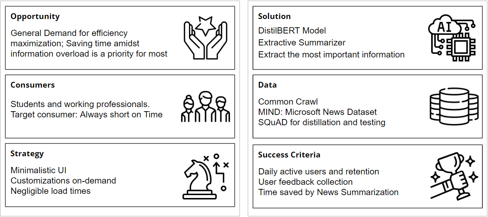
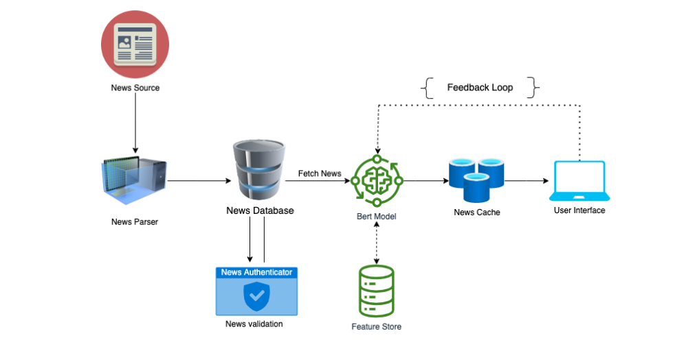
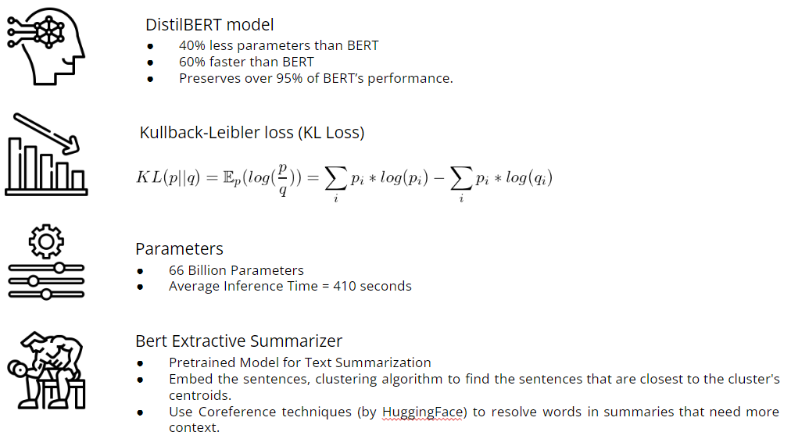

 

# BitNews
Bits of News that matter  
  

BitNews is a news summarizer built using DistilBERT. We utilize the extractive summarizer to pre-cache news articles into smaller, easy-to-digest formats. Visit the website for a demo of the MVP!

 

## Product Canvas

## Architecture

## Model  

